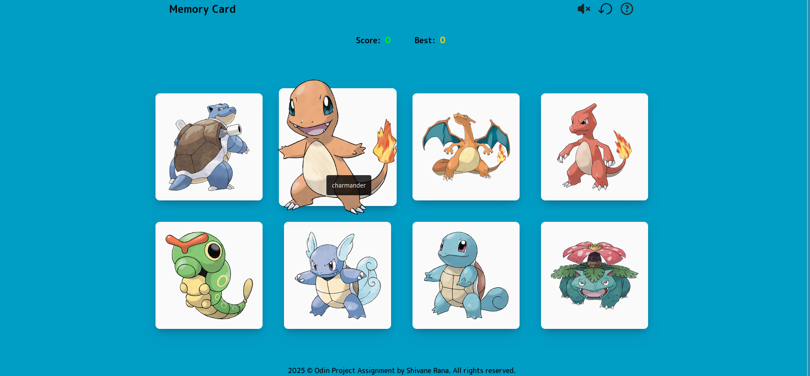

# Memory-Card

**Memory-Card** is a game for testing memory by clicking on unique Pokémon cards without repeating any selection. If you click the same card twice, the game resets.

## Features

- **Reset Functionality** – Restart the game at any time.
- **Toggle Sound Effects** – Mute or unmute game sounds easily.
- **Game Info Panel** – Access gameplay instructions and rules.
- **Memory Challenge** – Cards reshuffle after each correct click.
- **Score Tracker** – Tracks your current and best scores in real time.

## Screenshots

### Mobile Version


### PC Version



## Tech Stack

- **React**
- **ModularCSS**
- **Javascript**
- **HTML**

## 

## Installation

Follow these steps to get **Resume Canvas** running locally on your machine:

### 1. Clone the Repository

```bash
git clone https://github.com/ShivaneRana/Resume-Canvas.git
cd Resume-Canvas
```

### 2. Install Dependencies

Make sure you have [Node.js](https://nodejs.org/) and [npm](https://www.npmjs.com/) installed.

```bash
npm install
```

### 3. Start the Development Server

```bash
npm run dev 
```

This will launch the app in your browser at [http://localhost:5173](http://localhost:5173).

### 4. Build for Production

To create an optimized production build:

```bash
npm run build
```

This will generate static files in the `dist/` directory.
